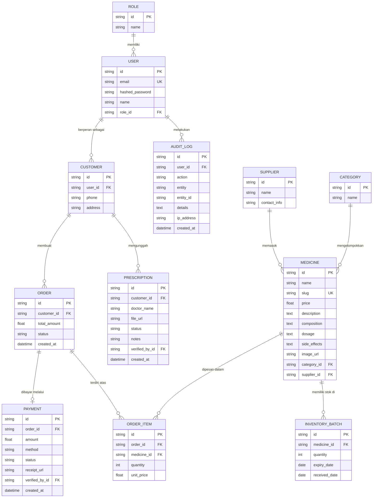

# 1. Entity Relationship Diagram (ERD) & Skema Database
**Sistem E-Commerce Klinik Makmur Jaya**

Dokumen ini menjelaskan struktur entitas dan relasi basis data yang digunakan dalam Sistem Informasi Manajemen Apotek & E-Commerce Makmur Jaya.

## 1.1. Entity Relationship Diagram (ERD)

Berikut adalah pemetaan visual dari model data menggunakan notasi *Crow's Foot*.

## 1.2. Penjelasan Skema Utama

1. **Modul Autentikasi (`USER`, `ROLE`)**: 
   Sistem Role-Based Access Control (RBAC). `Role` memisahkan akses untuk Admin, Apoteker, Kasir, dan Pelanggan. `User` menyimpan kredensial (ter-hash).
2. **Modul Inventaris (`MEDICINE`, `INVENTORY_BATCH`, `CATEGORY`, `SUPPLIER`)**: 
   Menerapkan sistem FIFO (First-In, First-Out). Satu obat (`MEDICINE`) dapat memiliki banyak tumpukan stok (`INVENTORY_BATCH`) dengan tanggal kedaluwarsa (`expiry_date`) yang berbeda-beda.
3. **Modul Transaksi (`ORDER`, `ORDER_ITEM`, `PAYMENT`)**: 
   Keranjang belanja diproses menjadi `ORDER`. Bukti bayar akan disimpan referensinya di `PAYMENT.receipt_url` dan diverifikasi oleh admin.
4. **Modul Rekam Medis & Audit (`PRESCRIPTION`, `AUDIT_LOG`)**: 
   Resep fisik/digital yang diunggah pelanggan disimpan di `PRESCRIPTION`. Seluruh aktivitas krusial pengguna terekam secara persisten di `AUDIT_LOG`.
